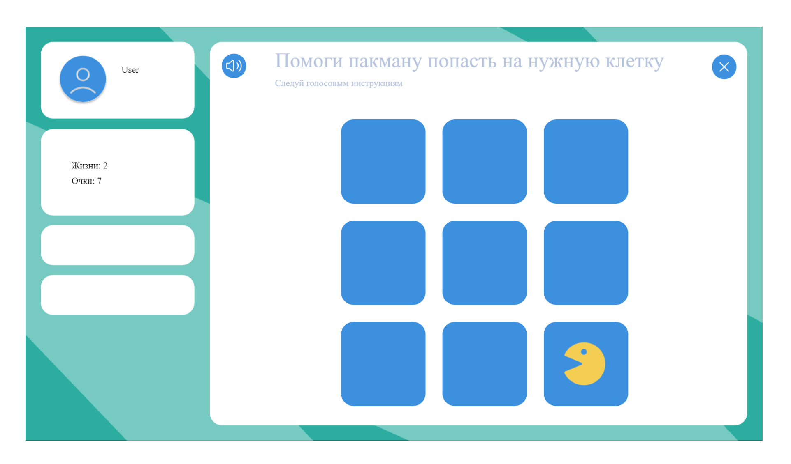

# phaser-project
This project is a **Phaser 3 game** written in vanilla **JavaScript**.

It was made as part of my contribution to a website for children with **dysgraphia** (children that have difficulties spelling correctly due to a neurological disorder).

The game has the following features:
- a player can listen to the intro task while being on the splash screen;
- once a player gets passed the splash screen into the game, a player's task is to lead the game's main pacman-like character across the grid to the correct cells;
- landing on the right cell results in awarded points/stars;
- landing on the wrong cells results in decreased attempts (total 3 wrong tries available);

A screenshot from the game:

